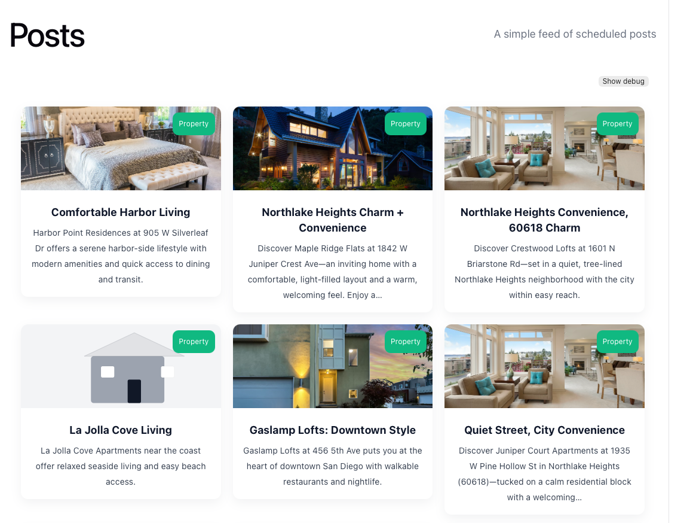
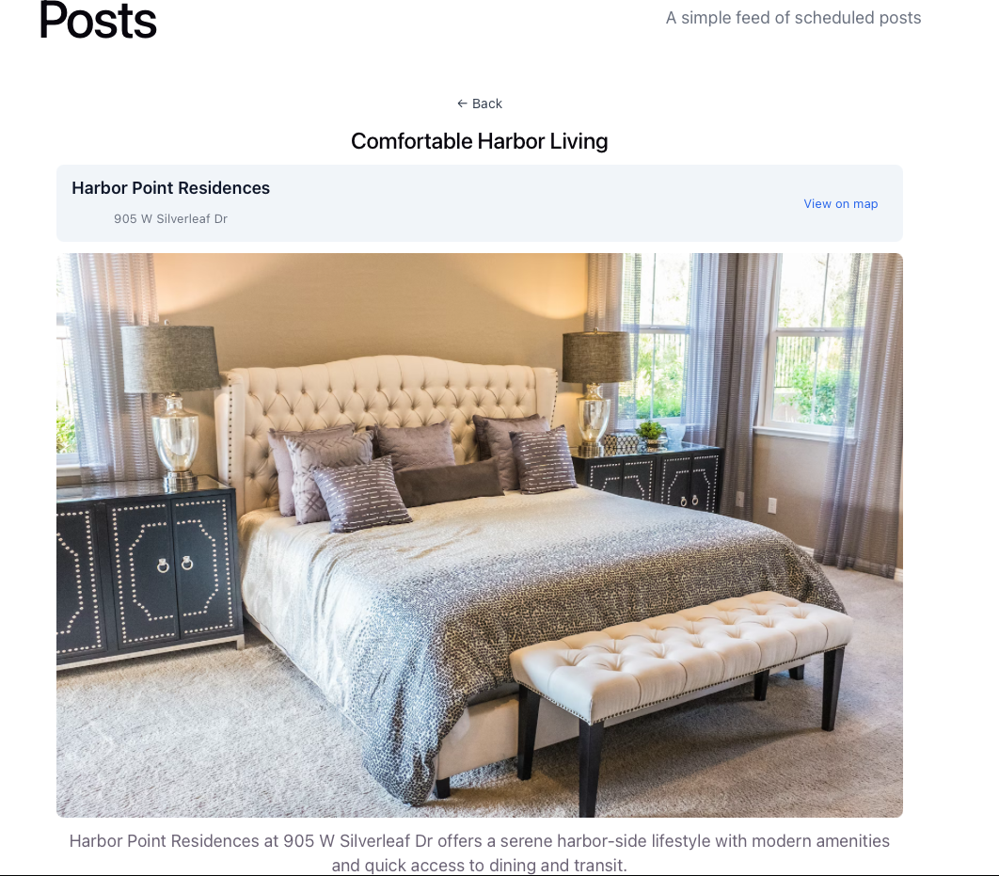

# aws-node-http-api-project

[](https://github.com/fcastellanos/social-media-posts-serverless/actions/workflows/ci.yml)

This project is a Serverless Framework (v4) Node.js HTTP API for AWS using TypeScript Lambda handlers and DynamoDB for persistence.

- Summary

- API endpoints implemented as AWS Lambda functions (TypeScript):
  - POST /properties — create a Property (description is optional)
  - GET /properties — list Properties (queries a GSI)
  - GET /properties/{id} — get a single Property by id (returns 404 if missing)
  - POST /posts — create a Social Media Post (can reference a property, include photos)
  - GET /posts — list Posts (queries a GSI)
  - GET /posts/{id} — get a single Post by id (returns 404 if missing)
- Single DynamoDB table: `${self:service}-properties-table` with a Global Secondary Index `EntityTypeIndex` on `entityType` + `SK` for efficient listing.
- Responses include `Content-Type: application/json` so API Gateway returns JSON.

Repository layout

- `src/handlers/` — TypeScript Lambda handlers (one small file per function)
- `src/lib/` — shared business logic and the central `repository.ts` data layer
- `scripts/` — helper scripts (seed data, export payloads)
- `test/` — Vitest unit tests (handlers and `src/lib` are unit-tested with DynamoDB mocked)
- `serverless.yml` — Serverless config, functions, resources and IAM role statements
- `tsconfig.json` — TypeScript config
- `package.json` — scripts and dependencies

Quick start

1. Install dependencies:

```bash
npm install
```

2. Run tests:

```bash
npm test
```

3. Local development (Serverless Offline):

```bash
npm run start
```

4. Package or deploy (uses Serverless v4 built-in esbuild):

```bash
# package (build artifacts)
serverless package

# deploy to AWS
serverless deploy
```

## API Endpoints

The HTTP API exposes the following endpoints. Replace `<api-id>` and `<region>` with your deployed API Gateway values or use the custom domain you configure.

- GET /posts — list posts
- GET /posts/{id} — get a single post by id (returns 404 if missing)
- POST /posts — create a post
- GET /properties — list properties
- GET /properties/{id} — get a single property by id (returns 404 if missing)
- POST /properties — create a property

Example curl requests (replace placeholders):

```bash
# List posts
curl -sS https://<api-id>.execute-api.<region>.amazonaws.com/posts

# Get a single post
curl -sS https://<api-id>.execute-api.<region>.amazonaws.com/posts/<POST_ID>

# List properties
curl -sS https://<api-id>.execute-api.<region>.amazonaws.com/properties

# Get a single property
curl -sS https://<api-id>.execute-api.<region>.amazonaws.com/properties/<PROPERTY_ID>

# Create a post (example)
curl -sS -X POST https://<api-id>.execute-api.<region>.amazonaws.com/posts \
  -H 'Content-Type: application/json' \
  -d '{"body":"Hello","propertyId":"p1"}'

# Create a property (example)
curl -sS -X POST https://<api-id>.execute-api.<region>.amazonaws.com/properties \
  -H 'Content-Type: application/json' \
  -d '{"title":"My Place","address":"123 Main St","latitude":1,"longitude":2}'
```

## GraphQL (AppSync)

This project also exposes a GraphQL API using AWS AppSync.

- GraphQL is an additional read interface that reuses the same repository/data layer.

### Current GraphQL operations

Defined in `schema.graphql`:

- `listProperties: PropertiesResult!`
- `getProperty(id: ID!): Property`
- `listPosts: PostsResult!`
- `getPost(id: ID!): Post`

### Get the GraphQL endpoint URL

Option 1: AWS Console

- Open AppSync in AWS Console
- Select API: `<service>-graphql`
- Copy the GraphQL endpoint URL

Option 2: AWS CLI

```bash
# Replace with your deployed AppSync API name if needed
API_NAME=aws-node-http-api-project-graphql

aws appsync list-graphql-apis \
  --query "graphqlApis[?name=='${API_NAME}'].uris.GRAPHQL | [0]" \
  --output text
```

### Get the GraphQL API key

This AppSync config uses `API_KEY` auth, so requests need `x-api-key`.

```bash
API_NAME=aws-node-http-api-project-graphql

API_ID=$(aws appsync list-graphql-apis \
  --query "graphqlApis[?name=='${API_NAME}'].apiId | [0]" \
  --output text)

API_KEY=$(aws appsync list-api-keys \
  --api-id "$API_ID" \
  --query "apiKeys[0].id" \
  --output text)

echo "API_ID=$API_ID"
echo "API_KEY=$API_KEY"
```

### Call GraphQL with curl

```bash
GRAPHQL_URL="https://<your-appsync-id>.appsync-api.<region>.amazonaws.com/graphql"
GRAPHQL_API_KEY="<your-api-key>"

curl -sS "$GRAPHQL_URL" \
  -H 'Content-Type: application/json' \
  -H "x-api-key: $GRAPHQL_API_KEY" \
  -d '{
    "query":"query ListPosts { listPosts { items { id title body scheduled_at property { id title address } photos { id url } } } }"
  }'
```

### Call GraphQL from Postman

1. Create a `POST` request to your AppSync GraphQL URL.
2. Add headers:
   - `Content-Type: application/json`
   - `x-api-key: <your-api-key>`
3. Use `Body -> raw -> JSON` and send:

```json
{
  "query": "query GetProperty($id: ID!) { getProperty(id: $id) { id title address latitude longitude } }",
  "variables": {
    "id": "<PROPERTY_ID>"
  }
}
```

If you get `Unauthorized`, verify the API key is active and that you are calling the AppSync URL (not the HTTP API URL).

## Seeding & Clearing Data

- The project provides two safe ways to run seeds:
  - Locally via `scripts/seed.js` (dry-run supported)
  - In AWS via an admin Lambda `adminSeeder` invoked with `serverless invoke` (recommended for running against deployed table)

Environment variables and actions (local script):

- `RUN_SEEDS=true` — allow the local seed script to run (safety guard)
- `SEED_ACTION` — which action to run (default: `create`). Supported values: `create`, `clear:posts`, `clear:properties`, `clear:all`/`clear:table`
- `DRY_RUN=true` — show what would happen without performing destructive writes
- `FORCE=true` — skip the interactive confirmation when deleting (use with care)

Examples (local dry-run / manual run):

```bash
# Local dry-run creating items (no AWS creds required)
npm run seed:dry

# Local create (requires PROPERTIES_TABLE_NAME and valid AWS creds in env)
PROPERTIES_TABLE_NAME=your-table RUN_SEEDS=true SEED_ACTION=create npm run seed

# Local dry-run clearing all items
PROPERTIES_TABLE_NAME=your-table RUN_SEEDS=true SEED_ACTION=clear:all DRY_RUN=true npm run seed:dry

# Local force delete (non-interactive)
PROPERTIES_TABLE_NAME=your-table RUN_SEEDS=true SEED_ACTION=clear:properties FORCE=true npm run seed:clear:properties
```

Examples (invoke admin Lambda in AWS — recommended for deployed tables):

```bash
# Dry-run in AWS (no destructive writes)
npm run invoke:seed:dry

# Run create in AWS
npm run invoke:seed:create

# Force delete everything in AWS
npm run invoke:seed:clear:all:force
```

More `serverless invoke` examples and variants:

```bash
# Invoke directly with a custom payload (clear posts, require --data JSON)
serverless invoke -f adminSeeder --data '{"action":"clear:posts","force":true}'

# Use a file for the event payload (helpful for complex payloads)
serverless invoke -f adminSeeder --path ./scripts/seeds.json

# Invoke the function locally (runs the handler in your local environment)
serverless invoke local -f adminSeeder --data '{"action":"create"}'

# AWS CLI example (invoke deployed Lambda by name; replace <FUNCTION_NAME>)
# writes output to response.json
aws lambda invoke --function-name <FUNCTION_NAME> --payload '{"action":"create"}' response.json

# Or use the npm helper scripts (preferred for consistent payloads)
npm run invoke:seed:dry    # dry-run
npm run invoke:seed:create # create
npm run invoke:seed:clear:all:force        # clear:all + force
npm run invoke:seed:create:dry         # create (dry-run)
npm run invoke:seed:clear:posts        # clear posts
npm run invoke:seed:clear:posts:dry    # clear posts (dry-run)
npm run invoke:seed:clear:posts:force  # clear posts (force)
npm run invoke:seed:clear:properties   # clear properties
npm run invoke:seed:clear:properties:dry # clear properties (dry-run)
npm run invoke:seed:clear:properties:force # clear properties (force)
npm run invoke:seed:clear:all         # clear all (no force)
npm run invoke:seed:clear:all:dry     # clear all (dry-run)
npm run invoke:seed:clear:all:force   # clear all (force)
```

Notes:

- The admin seeder Lambda runs in AWS and inherits IAM permissions from the function role; prefer this for operations against the deployed table.
- The local script uses the AWS SDK default provider chain; ensure your shell has credentials (`AWS_PROFILE`, `AWS_ACCESS_KEY_ID`, etc.) when running non-dry operations locally.

## Frontend

This repository includes a small frontend app under `web/` used for local development and previewing the `/posts` endpoint. It is intentionally kept out of Lambda artifacts (see `serverless.yml` `package.exclude`).

- **Stack:** Vite + React + TypeScript
- **Source:** `web/src/` (components, hooks, styles)
- **Dev server:** `cd web && npm install && npm run dev`
- **Build:** `cd web && npm run build` — output is placed in `web/dist`
- **Env:** frontend reads `VITE_API_BASE` (for production builds). During local development the client uses relative paths so `vite` dev proxy can forward `/posts` to your API.
- **Dev proxy:** see `web/vite.config.ts` for proxy rules that forward `/posts` and `/properties` to the backend during development.

Screenshot (preview of the Posts feed):




Notes

- DynamoDB table: created by the CloudFormation template in `serverless.yml`. The table name is `${self:service}-properties-table`. The `PROPERTIES_TABLE_NAME` environment variable is set for Lambdas.
- Data layer: `src/lib/repository.ts` centralizes DynamoDB access and maps DB items to API shapes. Handlers call the repository for CRUD operations.
- Tests: unit tests mock `@aws-sdk/lib-dynamodb` and run with Vitest. Tests now include handler tests and repository tests. Run `npm test` or `npm run test:ci` for non-interactive runs.
- Coverage: a `test:coverage` script is available; CI can use `c8` or upgrade Vitest to a 4.x line to use `@vitest/coverage-v8` for V8-based coverage reporting. Locally we use `npx c8 --reporter=text npm run test:ci` as a workaround.
- Request validation: handlers perform simple required-field checks. `metadata`/`description` on properties is optional.

Local setup

1. Install AWS CLI (if not already installed)

```bash
# macOS (Homebrew)
brew install awscli

# verify
aws --version
```

2. Configure AWS credentials (recommended: use a named profile)

```bash
aws configure --profile myprofile
# follow prompts to enter AWS Access Key ID, Secret Access Key, region (e.g. us-east-1)
```

Or create `~/.aws/credentials` with:

```
[myprofile]
aws_access_key_id = AKIA...YOURKEY
aws_secret_access_key = YOUR_SECRET
```

3. Point Serverless / local tools at the profile (example using environment variable):

```bash
export AWS_PROFILE=myprofile
export AWS_REGION=us-east-1
```

4. Optional: local DynamoDB for integration testing

You can run DynamoDB Local via Docker:

```bash
docker run -p 8000:8000 amazon/dynamodb-local
```

Then set the `ENDPOINT` environment variable and update handlers to connect to `http://localhost:8000` for local testing, or run `serverless offline` which can emulate API Gateway but requires additional plugin configuration for local DynamoDB wiring.

5. Helpful commands

```bash
# install deps
npm install

# run unit tests (interactive)
npm test

# run unit tests (CI / non-interactive)
npm run test:ci

# run typescript check / lint
npm run lint

# run coverage (local workaround using c8)
npx c8 --reporter=text npm run test:ci

# start local dev (serverless offline)
npm run start

# package (build artifacts)
serverless package

# deploy to AWS (uses current AWS_PROFILE/AWS_REGION)
serverless deploy
```
